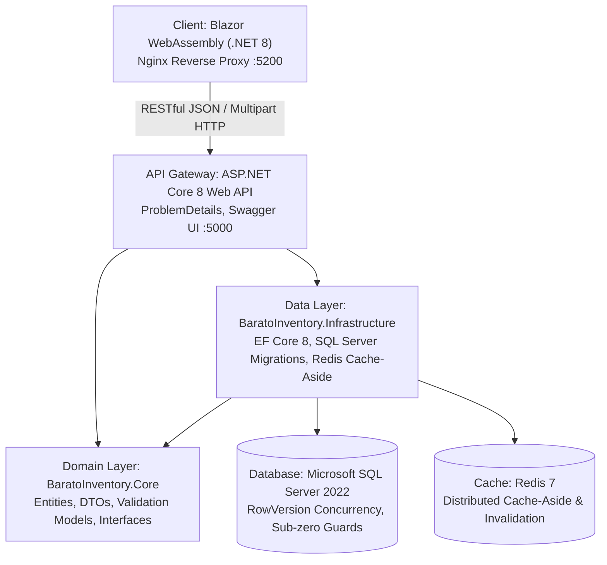

# Barato Product Inventory App

[](https://dotnet.microsoft.com/)
[](https://dotnet.microsoft.com/apps/aspnet/web-apps/blazor)
[](https://www.microsoft.com/sql-server/)
[](https://redis.io/)
[](https://www.docker.com/)
[](BaratoInventory.Tests/)

An enterprise-grade, high-concurrency product inventory management system engineered for **KCC Mall of General Santos City**. Built with **Clean Architecture**, **.NET 8 LTS**, **Blazor WebAssembly**, **Entity Framework Core**, **SQL Server 2022**, and **Redis 7** distributed caching.

Developed and Architected by **Ralph Lester Billanes**.

---

## 🏗️ Architecture & Technology Stack

The solution strictly adheres to **Clean Architecture** and **SOLID** principles, maintaining strict separation of concerns, testability, and enterprise maintainability:



### Layer Breakdown
*   **`BaratoInventory.Core`**: Domain layer containing aggregate entities (`Product`), property-based DTOs, custom domain exceptions (`ConcurrencyException`), and interface contracts (`IProductService`, `ICacheService`). Zero external framework dependencies.
*   **`BaratoInventory.Infrastructure`**: Data access layer implementing EF Core 8 `AppDbContext`, Fluent API entity mappings, timestamp rowversions, and `RedisCacheService` with deterministic prefix invalidation.
*   **`BaratoInventory.API`**: RESTful presentation layer exposing versioned endpoints (`ProductsController`), global exception handling mapped to RFC 7807 `ProblemDetails`, OpenAPI/Swagger specifications, and static media hosting.
*   **`BaratoInventory.Blazor`**: Standalone client-side WebAssembly application with responsive UI, dynamic category combobox, image preview uploaders, accessible tooltips, and real-time inventory tracking.
*   **`BaratoInventory.Tests`**: Automated test suite with **35 unit tests** using NUnit and Moq verifying domain rules, InMemory DB operations, optimistic concurrency recovery, and controller HTTP status mappings.

---

## 🚀 Key Features

*   **Real-Time Inventory Dashboard**: View live product catalogs with stock badges, Philippine Peso (`₱`) currency formatting, and product imagery.
*   **Sub-Zero Stock Protection**: Business rules enforced at both the application and database levels to prevent negative stock quantities.
*   **Optimistic Concurrency Control**: Uses SQL Server 8-byte `ROWVERSION` concurrency tokens. Detects concurrent edit collisions and provides seamless in-modal conflict recovery (**🔄 Reload Latest Version** or **⚡ Overwrite**).
*   **Cache-Aside Pattern with Deterministic Eviction**: Powered by Redis 7. Reads are cached with 10-minute sliding TTLs; any write, stock adjustment, or product deletion triggers automatic cache invalidation by prefix.
*   **Category Management & Live Combobox**: Searchable, keyboard-navigable combobox allowing users to filter by category or instantly create and assign new product categories on the fly.
*   **Client & Server Media Processing**: Image uploads supporting JPEG, PNG, and WebP formats with a strict 2MB limit, instant client-side preview, and static serving.
*   **Responsive KCC Corporate Theme**: Styled with KCC Mall of General Santos City corporate colors, sticky navbar, catalog redirection, zero layout shift, and tactile button depression feedback.
*   **Configurable Settings & Diagnostics**: In-app settings page with dynamic API gateway endpoint switching, live ping latency testing, and cloud storage targets.

---

## 🏃 Quick Start (Docker Compose)

The fastest and most reliable way to spin up the entire multi-container stack:

1.  **Clone the repository:**
    ```bash
    git clone https://github.com/YOUR_USERNAME/BaratoProductInventoryApp.git
    cd BaratoProductInventoryApp
    ```

2.  **Start all services in detached mode:**
    ```bash
    docker compose up --build -d
    ```

3.  **Database Migration & Seeding:**
    Database migrations and local Filipino retail product seed data (beverages, snacks, canned goods, household items) are applied automatically on startup.

4.  **Access the applications:**
    *   🛒 **Blazor WASM Client**: [http://localhost:5200](http://localhost:5200)
    *   📚 **Swagger API Documentation**: [http://localhost:5000/swagger](http://localhost:5000/swagger)
    *   ⚡ **API Health / Root**: [http://localhost:5000/api/products](http://localhost:5000/api/products)

5.  **Tear down services:**
    ```bash
    docker compose down
    ```

---

## 💻 Local Development (Visual Studio 2022 / CLI)

To develop locally with hot reload:

1.  **Start SQL Server & Redis via Docker:**
    ```bash
    docker compose up -d barato-db barato-cache
    ```

2.  **Open the solution:**
    Open `Barato Product Inventory App.sln` in Visual Studio 2022.

3.  **Configure Multiple Startup Projects:**
    *   Right-click Solution -> **Configure Startup Projects...**
    *   Select **Multiple startup projects**
    *   Set `BaratoInventory.API` to **Start** (runs on `https://localhost:7207` or `http://localhost:5000`)
    *   Set `BaratoInventory.Blazor` to **Start** (runs on `https://localhost:7028`)
    *   Press `F5` to start debugging.

---

## 🧪 Running Automated Tests

Run the full automated test suite from the CLI:

```bash
dotnet test
```

### Test Coverage Highlights:
*   `ProductServiceTests`: Verifies cache hit/miss semantics, deterministic invalidation, sub-zero stock rejections, and `ConcurrencyException` handling.
*   `ProductsControllerTests`: Validates RFC 7807 `ProblemDetails` output, `204 NoContent`, `400 BadRequest`, `404 NotFound`, and `409 Conflict` HTTP mappings.
*   `ValidationTests`: Exercises domain entity requirements, price constraints, name lengths, and DTO data annotations.

---

## 📄 License & Attribution

Designed and Developed by **Ralph Lester Billanes** for **KCC Mall of General Santos City**.  
Released under the [MIT License](LICENSE).
